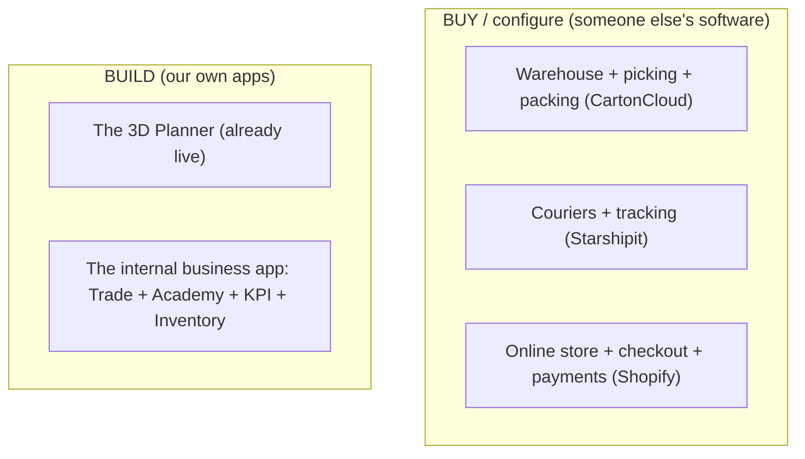
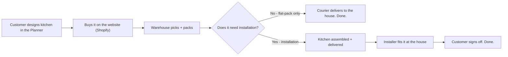
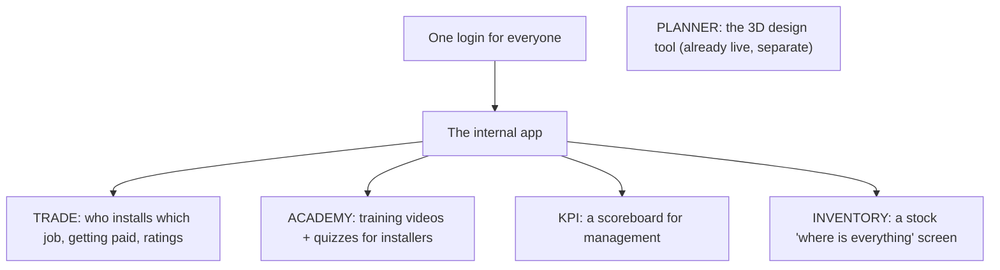
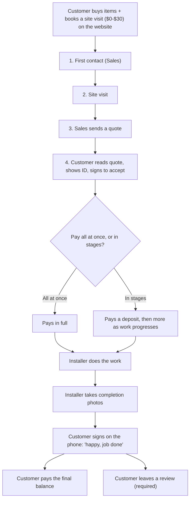
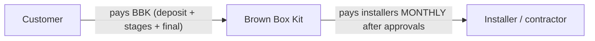
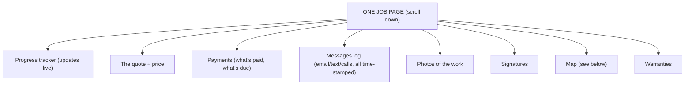
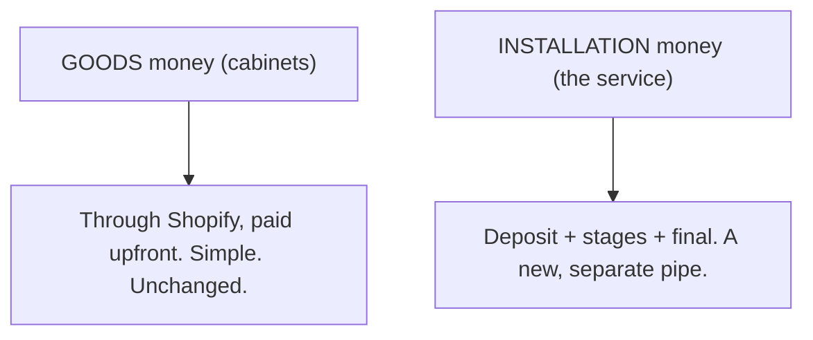
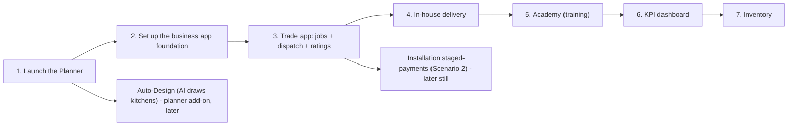

# Brown Box Kit — The Whole System, in Plain English

> A simple, visual companion to `FEASIBILITY.md`. **Same plan — no coding jargon.**
> Tip: read this in Markdown Preview (`Ctrl+Shift+V`) so the diagrams show as pictures.
> Nothing here is being built yet. This is for you to review and react to.

---

## 1. The big idea (in one breath)

Brown Box Kit sells flat-pack kitchens online. We're building software so a customer can:

1. **Design** their kitchen in 3D on the website,
2. **Buy** it, and
3. (optionally) **have it installed** — with the whole job tracked from "click" to "finished kitchen."

That's it. Everything below is just the detail of how those three things happen and who does what.

---

## 2. What we BUILD vs what we BUY

A lot of this is **not** custom software — it's existing products we just switch on and configure. That saves huge time and money. Only the green boxes are things we actually build.

- **Buy:** the shop, the payments, the warehouse, the couriers. Mature products, just set up.
- **Build:** the design tool (the Planner) and one internal app for running the business.

---

## 3. The journey of one order (the map)

Here's what happens when someone buys a kitchen, start to finish:

The simple path (no install) is basically working today. The installation path is the big new piece (see section 5).

---

## 4. The apps, in plain words

We're building **one** internal app with five "rooms" inside it (not five separate apps). Everyone logs in once and sees only the rooms their role allows.

- **Planner** — the 3D kitchen designer. Already live and working.
- **Trade app** — the heart of the business app: assigns installation jobs, tracks them, pays installers, collects customer ratings.
- **Academy** — upload a training video, the system writes a quiz, installers must pass monthly.
- **KPI** — a management dashboard: who's performing, who brought in leads, bonus calculations.
- **Inventory** — a simple "what stock is where" view (your own warehouses + what the 3PL reports).

---

## 5. The installation workflow (the new detailed part)

This is "Scenario 2" — when a customer wants BBK to install, not just deliver. Think of it as **one page per job that you scroll down**, like a social-media feed, where each section is a little tool ("widget").

### The steps, in order

### Two separate money directions

Don't confuse these — they're different:

- **Money IN (customer → BBK):** deposit, then staged payments, then final balance after they sign off.
- **Money OUT (BBK → installers):** the installer marks a job done → a manager checks it → a senior manager bulk-approves → head office pays installers **once a month**. Until payout, the installer's earnings sit as "credits" in the app.

### The job page = scrollable "widgets"

Each job is one page you scroll. Each block is a mini-tool. People see different blocks depending on their role.

### The map (your new idea)
- An **installer opens the map** and sees all their jobs as pins. On the day, they tap a job and it opens directions to drive there.
- When a **new job comes in**, the system finds the **nearest free installer**, offers it to them with a countdown, and if they don't accept in time, it offers it to the **next-nearest** — like how Uber finds a driver.

### Warranties
Every finished job starts three clocks automatically: **3 months** (defects), **1 year** (workmanship), **10 years** (materials).

> **Important note:** the staged-payment and ID parts touch real NZ rules (Construction Contracts Act, Privacy Act). You've said your paperwork for this already exists and is in use — the app's job is just to send it and keep a record. We'd still want a careful look at the ID-capture and personal-guarantee parts before building.

---

## 6. How the money flows (simple version)

Two pipes, kept separate on purpose:

Keeping them separate means the simple, working part (selling cabinets) stays simple, and only the installation service gets the more complex staged-payment handling.

---

## 7. The plan over time (what happens when)

We do things in order so we never bite off too much at once. **The golden rule: launch the Planner first.** Don't build fancy future features while the main product is still unlaunched.

- **Now:** finish and launch the Planner.
- **Soon (in parallel, second account):** start the business-app foundation, then the Trade app.
- **Later:** training, dashboards, inventory.
- **Much later:** the AI Auto-Design feature, the full staged-payment installation workflow, and white-label (renting the planner to other brands).

---

## 8. The main risks (in plain words)

- **Keep people's data separate and locked.** The #1 rule: one customer can never see another's information. (We have a security setup for this; it must never be turned off.)
- **Don't over-build before launch.** The biggest danger is spending time/budget on future features while the main product isn't live yet.
- **The installation payments + ID need legal care.** Taking deposits and staged payments, and capturing ID, has rules attached. Your existing paperwork covers a lot; the sensitive bits still deserve a careful review.
- **Paying installers fairly and on time.** The monthly payout + "credits" system needs to be accurate and clear.

---

## 9. What still needs YOU to decide

None of these block anything today — just things to make a call on before the relevant part gets built:

- A name for the new business-app project, and the web addresses for each app (e.g. `trade.brownboxkit.co.nz`).
- For installation staged-payments: does the customer pay the final balance the moment they sign, or after a manager double-checks? What deposit % (always 50%, or depends on job size)?
- Which outside services to use for: text messages + calls, maps/directions, and ID checks.
- How long to keep customer data (a privacy choice).
- Whether "renting the planner to other brands" (white-label) is a real future goal or just a nice-to-have.

---

### One-line summary
We're building a 3D kitchen designer plus one internal app to run installations, training, performance, and stock — while buying the shop, warehouse, and courier parts off the shelf. **Launch the designer first, then build the rest in sensible order, and keep the money + data simple and safe.**
