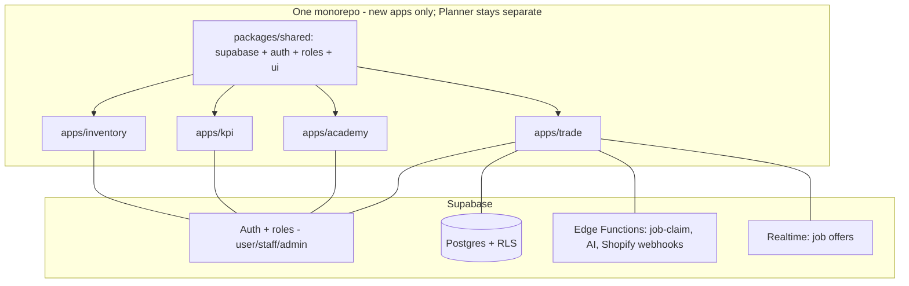
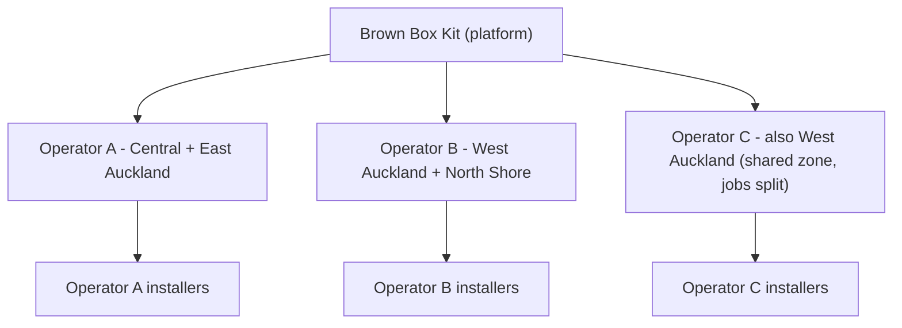
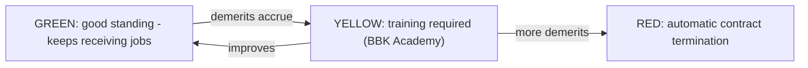
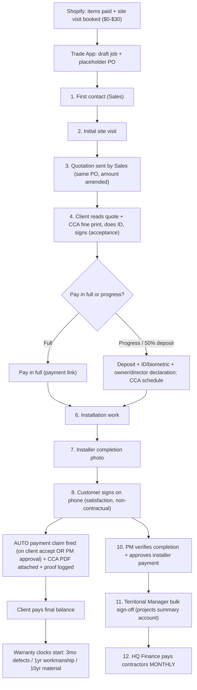
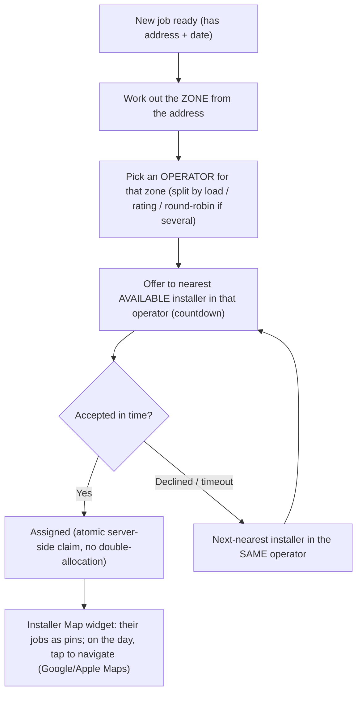
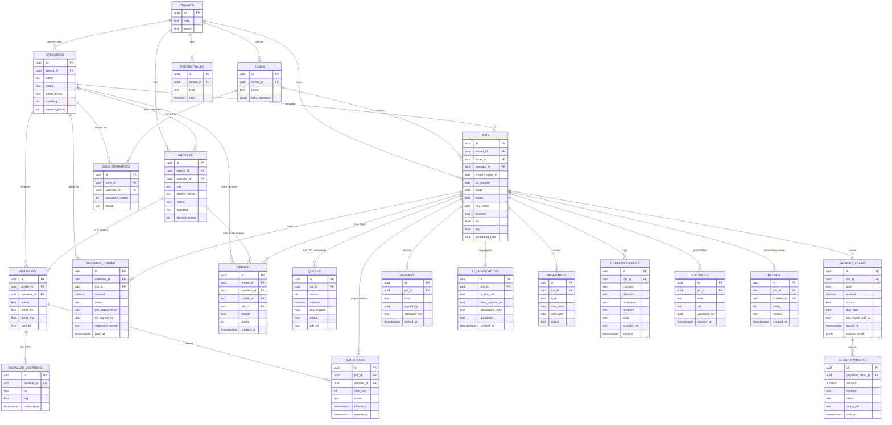

# Brown Box Kit — Full Ecosystem Feasibility Study

> Planning document. **No application code is changed by this file.**
> Tip: read this with Markdown Preview (`Ctrl+Shift+V`) for full-width formatting.
> Companion to `ARCHITECTURE.md` (the Planner) and `AUTO-DESIGN-PLAN.md` (auto-design).
> This doc covers the **wider system**: Planner + Shopify + CartonCloud + Trade App +
> Academy + KPI + Inventory, as a **single business entity**.

> **Revision (simplified model):** collapsed the former A/B/C three-entity model to a
> **single entity**; removed the Stripe installation-payments rail and all credit-check /
> interest / refund machinery (all money flows through **Shopify standard checkout**);
> scoped the **Inventory App as a network-visibility layer** that reads the **Shopify Admin
> API** (not the CartonCloud API) and surfaces CartonCloud as one virtual warehouse; added
> an **in-house delivery leg** (workshop -> customer) inside the Trade App. Inter-company
> arrangements, if any, are contractual — not modelled in the software.

---

## 0. What this document is for

A shared "single picture" of the whole business system, written **before** money is spent
on building it. It exists so that:

- **You** record the big decisions once (feasible? build-vs-buy, one-app-vs-many,
  scope boundaries) instead of re-deciding them later.
- **Your accountant + lawyer** can read the commerce/fulfilment boundaries and advise —
  noting that customer money flows entirely through Shopify standard checkout.
- **Opus / any agent** gets the context to design the hard parts (identity, dispatch
  concurrency, inventory trust boundaries) without re-explaining the system.
- **Your trainee** can orient to the whole system, not just one code file.

It is documentation, not code. It guides the build and de-risks decisions.

---

## 1. Verdict (up front)

**The ecosystem is feasible, and a large part of it is buy/configure, not build.**

- The entire **fulfilment leg** (Shopify checkout -> CartonCloud Sale Order -> pick/pack/
  dispatch -> Starshipit courier -> tracking back to Shopify) is **off-the-shelf
  SaaS-to-SaaS configuration**, not custom code.
- Your real **custom build** surface is: the Planner (largely done, incl. Send-to-Cart),
  and the internal **Trade + Academy + KPI + Inventory** app.
- Recommended build of the internal app: **ONE monorepo, ONE Supabase auth with roles,
  four role-gated surfaces** (Trade, Academy, KPI, Inventory) — not separate apps.
- **Payments are out of scope:** BBK is the sole vendor and all customer money flows
  through **Shopify standard checkout**. This removes the single biggest legal/regulatory
  risk (no Stripe rail, no credit checks, no interest/refund engine to build).

---

## 2. Build vs Buy (the key feasibility split)

### Buy / configure (vendor-managed, no custom code)

| Capability | How | Notes |
|---|---|---|
| Shopify order -> CartonCloud Sale Order | Native CartonCloud Shopify integration | Transfers address, line items, order ref |
| Inventory sync + fulfilment status + tracking back to Shopify | CartonCloud | Auto-marks Shopify order fulfilled at a chosen status |
| CartonCloud -> couriers (NZ Post, CourierPost, etc.) | Starshipit (integration built by CartonCloud) | Tracking returns to CartonCloud -> Shopify |
| Pick / Pack / Dispatch + warehouse pickup w/ PO | CartonCloud workflow features | — |

> **Caveat:** CartonCloud's Shopify + Starshipit setup is **support-gated and quoted**
> (paid onboarding, per-API-call costs) — a lead-time + budget item, not a code item.
> Start this vendor conversation early.

### Build (custom)

- Send-to-Cart in the Planner (`cartCreate` -> `cart.checkoutUrl`) — done.
- Trade App, Academy, KPI, Inventory (the internal PWA surfaces).
- A small backend (Supabase Edge Functions) for anything that can't be client-side:
  Shopify webhooks (orders, inventory), job-claim concurrency, AI question generation.
  (No payments backend — money is Shopify-standard.)

---

## 3. Single entity (simplified)

**BBK is one business entity.** The software does **not** model multiple companies, entity
tags, or inter-company licensing — any such arrangements are **contractual**, handled
outside the software. This is a deliberate simplification of the earlier A/B/C model.

Design rules that follow from this:

- **No entity tagging.** Rows are scoped by **user + role** via RLS, not by an entity tag.
  (If a true multi-tenant/white-label direction is ever pursued — `ARCHITECTURE.md`
  section 6, Phase 3 — it is a future, explicit re-architecture, not a day-one cost.)
- **One customer-facing payment rail:** **Shopify standard checkout**, BBK as merchant of
  record. Installation (if billed) is invoiced the same way or out-of-band; there is **no
  separate Stripe rail, no credit checks, no interest/refund engine** in scope.
- **One order, one source of truth = Shopify.** The Trade App `job` references the Shopify
  order; it does **not** re-create orders.

---

## 4. System map

```mermaid
flowchart LR
  subgraph entry [Sales entry]
    walkIn[Walk-in customer]
    showroom[Showroom iPad - browser Planner]
    walkIn --> showroom
  end

  subgraph design [Design + commerce - custom build]
    autoDesign[Auto-Design AI]
    planner[Kitchen Planner on Vercel]
    autoDesign --> planner
    planner -->|cartCreate| cart[Shopify Cart]
    cart --> checkout[Shopify Checkout]
  end
  showroom --> planner

  subgraph fulfil [Fulfilment - buy/configure - 3PL owns past scan-in]
    cc[CartonCloud Sale Order]
    pick[Pick Pack Dispatch]
    star[Starshipit couriers]
    cc --> pick
    pick --> star
  end
  checkout -->|native integration| cc
  cc -->|tracking + inventory back| checkout

  subgraph assembly [Assembly - Trade App workflow state]
    workshop["Workshop (jobs.stage at_workshop)"]
    assembled["Assembled (jobs.stage assembled)"]
    workshop --> assembled
  end
  pick -->|drop for assembly| workshop

  subgraph trade [Internal PWA - custom build - single entity]
    tradeApp[Trade App - dispatch + calculator]
    delivery[In-house delivery - workshop to house]
    academy[BBK Academy - LMS]
    kpi[KPI dashboard - admin]
    inventory["Inventory App - reads Shopify Admin API; CC as virtual warehouse"]
  end
  checkout -->|orders/paid webhook| tradeApp
  assembled --> tradeApp
  tradeApp --> delivery
  tradeApp --> academy
  tradeApp --> kpi
  checkout -.->|inventory_levels webhook| inventory

  star -->|direct: no assembly| house[Customer House]
  delivery -->|assembled kitchens| house
```

---

## 5. The one-app-vs-many decision

**Recommendation: one monorepo, one Supabase auth + roles, four role-gated surfaces
(Trade, Academy, KPI, Inventory).**

- **KPI has almost no data of its own** — it is a read-model over Trade jobs + Academy
  scores + Shopify orders. A separate app would just duplicate auth and data access.
- **Academy completion can gate Trade eligibility** ("certified to accept this install") —
  trivial with shared identity, an integration headache across three apps.
- One Google login, one installer profile, one deploy pipeline, one RLS policy set.
  Three separate apps = 3x auth/infra/maintenance for one team.
- You already own the stack (Vite + Supabase + Vercel + Google OAuth in `auth.js`) —
  extend it, don't fork it.

Structure (the existing Planner monolith is **left untouched and stays in its own repo**
per house rules; re-evaluate folding it in at Phase 7):

- `packages/shared` — Supabase client, auth, roles, UI primitives.
- `apps/trade`, `apps/academy`, `apps/kpi`, `apps/inventory` — thin PWAs importing `shared`.
- Each can deploy to its own subdomain (`trade.` / `academy.` / `kpi.` /
  `inventory.brownboxkit.co.nz`) for installable PWAs while sharing one codebase + one DB.

---

## 6. Module specs

### 6.1 Trade App

- **Job cost calculator** (admin-editable rates in a `pricing_rules` table):
  - Assembly: fixed **$20–40 per cabinet** (by cabinet type).
  - Base cabinet install: **$120 / metre**.
  - Wall cabinet install: **$240 / metre**.
  - Top filler: **$10 / metre**. Drawers: **$25 / drawer**.
  - **Quantities come from the Planner design** (cabinet count, base run m, wall run m,
    filler m, drawer count). One kitchen design produces both the material price (Shopify,
    B) and the installation price (calculator, C).
- **Uber-style dispatch:** a job is offered to one installer with a countdown; accept in
  time or it auto-passes to the next. Supports a 1st and 2nd installer. Completion triggers
  a **compulsory rating**.
- **Assembly workshop = workflow state** on the job, not a separate system:
  `jobs.stage = 'at_workshop' | 'assembled'` (lightweight for v1; revisit Inventory-node
  tracking later if needed).
- **In-house delivery leg (workshop -> customer house):** assembled kitchens are delivered
  by a BBK-managed driver (route view, maps handoff, proof-of-delivery photo + signature),
  using the **same dispatch engine** as install. **3PL last-mile (Starshipit) applies only
  when no assembly is required** — flat-pack ships direct from the 3PL.
- **Payments:** Shopify standard checkout only. No deposit/interest/refund logic, no credit
  checks, no separate installation payment rail in scope.

### 6.1a Trade App v2 — Managed Installation (Scenario 2)  [PROPOSED]

> **Status:** expands §6.1 and **deliberately reopens** the "Shopify-only, no progress pay"
> position in §3 / §9 / §11. The CCA progress-payment process is **already operational at
> BBK** — the app's job is to *execute and log* it, not invent it. Owner's call: no lawyer
> required for the CCA mechanics (template in use). Legal/privacy review still advisable for
> the personal-guarantee and ID/biometric capture. **Sits behind the Trade App core MVP —
> not a launch item.** Architecture (payments, dispatch concurrency, schema) → Opus before build.

**Two scenarios:**
- **Scenario 1 — goods only:** cart checkout → last-mile delivery → done. (Current model.)
- **Scenario 2 — goods + managed installation:** progress payments under the **Construction
  Contracts Act 2002**, run as a *project file* in the Trade App.

**Two money flows, kept separate (the key risk-limiter):**
- **Goods** → Shopify checkout, unchanged, BBK merchant of record.
- **Installation service** → new progress-pay rail (Stripe), CCA payment claims. Only the
  installation service carries the new complexity; goods stay simple.

**Platform structure: partner operators + zones**

BBK Trade is a **platform** that connects **preferred installation partner companies
("operators")** to jobs by **geographic zone**. BBK does **not** employ installers directly —
each operator company employs its own installers.

- **Stage 1 zones (Auckland):** Central, West, North Shore, East.
- **Stage 2 zones (wider NZ):** Hamilton, Tauranga, Christchurch, etc. — each new region is just
  another zone.
- **A zone can be served by more than one operator**, with jobs split between them (by load,
  rating, or round-robin — rule TBD). One operator can also cover several zones.

Payment is at the operator-company level and monthly — see "Operator settlement" below.

**Partnership model + accountability**

- **The operator is BBK's contracting partner and the liability shield.** The operator company
  (not the BBK platform) **signs the works contract with the customer** and carries the service
  liability. BBK Trade is the **platform**: it owns the tradie resource and the **allocation engine**.
- **Each operator runs a team:** an **owner/manager**, **Project Manager(s)**, and **Sales**
  (plus installers). The operator manages this team.
- **Jobs are allocated by the platform, not cherry-picked.** A binding partnership term: the system
  assigns each job to an operator's installer automatically; operators **cannot** manually pick and
  choose. Declining or missing allocated jobs accrues **demerits**.
- **Green / Yellow / Red standing (Uber-style accountability):**

  - Applied **both to the team (operator company) and to individuals** (owner/manager, PM, Sales,
    installer).
  - **Yellow** = mandatory training (ties to §6.2 Academy) before returning to green.
  - **Red** = automatic termination — **individual red** terminates that person; **team red**
    terminates the whole operator partnership.
  - The job contract is strictly tied to staying **green** (or **yellow-with-training**).

> **Legal note:** the "operator as liability shield + customer-contracting party" arrangement needs
> real agreements (a BBK↔operator partnership agreement and the operator↔customer works contract).
> This is a genuine legal structure — worth drafting/reviewing even though the CCA *mechanics* are
> already in use.

**Milestone workflow:**

**Payment model (client → BBK, money in):**
- Deposit / 50% at acceptance; progress payments via CCA payment claims; **final balance after
  the step-8 satisfaction signature**.
- **Auto payment claim:** fired automatically when completion is confirmed — **by client
  acceptance OR PM approval**. Claim email auto-attaches the existing CCA/homeowner PDF notice;
  app **logs proof of service** (CCA disputes hinge on proof the claim was served).
- **Client acceptance = read quote (CCA fine print) + ID + sign.** ID/biometric is compulsory
  **only on the progress-pay branch**, with an owner/director/authority declaration so liability
  attaches to the client personally or their company.

**Operator settlement (BBK → operator company, money out, monthly):**
- Per job: installer marks complete → **PM** verifies + approves → **Territorial Manager** bulk
  sign-off on the projects summary account → **HQ Finance** pays **monthly**.
- **BBK pays the operator COMPANY**, not individual installers: approved job amounts accrue into a
  **per-operator monthly statement**. Each operator then pays its own installers (outside BBK, or
  optionally tracked). Individual installers are still tracked in-app for **dispatch + ratings/KPI**,
  just not for payment.
- (The Construction Contracts Act also governs payments down to the operators.)

**Project File UX (the core screen):**
- **One project file per job, vertical scroll, live milestone tracker pinned at top.**
- **Modular widgets, role-gated** (installer / Sales / PM / TM / Finance / client see different
  widgets). Functions are added as widgets, not hard-wired screens.
- Widgets: milestone tracker · quote/PO · payment claims + client payments · correspondence log ·
  photos/evidence · signatures · contractor approval chain · warranties · **Map** (below).

**Communication hub:**
- **App-first**, but staff can manually send **email / SMS / voice** from the app as needed.
- **Every correspondence is timestamped and stored in the project file.** Sends go through Edge
  Functions to providers (email + SMS/voice e.g. Twilio); voice = click-to-call + logged call.
- Live milestones + new messages use **Supabase Realtime** so the vertical feed updates live.

**Map widget + dispatch (zone → operator → installer):**

- **Routing is two-step:** address → zone → operator company → nearest available installer within
  that operator; cascade to the next-nearest on decline/timeout.
- **If several operators share a zone**, the job is allocated among them first (by load / rating /
  round-robin — rule TBD), then offered inside the chosen operator.
- **Installer view:** a map of their assigned jobs; tap a job on the day to navigate to it.
- Claim must be atomic server-side (see §9 #2).

**Warranties:** 3-month defects · 1-year workmanship · 10-year material — three independent
clocks per job, started at completion; surfaced in the warranty widget for defect claims.

**Full data model (proposed):**

> Every table carries `tenant_id` (via the row's job/profile) and is RLS-scoped by user + role
> (+ tenant) per §7. New vendors introduced: **Stripe** (installation rail), **email + SMS/voice**
> (e.g. Twilio), and a **maps/geocoding** provider for proximity dispatch + navigation.

**Compliance notes (practical, not a substitute for advice):**
- **CCA already in use** — the app auto-attaches the CCA PDF and logs proof of service.
- **ID + face capture** is sensitive personal data (**Privacy Act 2020**): capture the minimum,
  encrypt, set a retention limit, clear consent. Only on the progress-pay branch.
- The owner/director **guarantee** is a *commercial* guarantee — likely **not** statutory AML;
  confirm BBK has no AML/CFT reporting obligation before calling it an "AML check."

**Sequencing:** Trade core MVP first (Scenario 1 + a **read-only** payment-status view from
Shopify). Scenario 2 is a later **"managed installation"** track, built widget-by-widget after
Opus signs off the payments + dispatch-concurrency + schema design.

### 6.1b Operator Agreement — heads of terms  [FOR REVIEW]

> Plain-English **heads of terms** (key points the BBK Trade ↔ Operator agreement should cover) —
> **not legal advice**. Once confirmed/adjusted, this becomes the brief for a properly drafted
> agreement. Items marked **(decide)** still need an owner decision. Several of these terms shape
> the data model + app behaviour (allocation, demerits, settlement), so they are recorded here.

- **A. Parties & structure** — BBK Trade (platform) and the Operator (independent contractor
  company). Explicitly **not** employee/agent/partner/franchise. Operator is the
  **customer-contracting party** and carries works liability ("the shield").
- **B. Platform licence** — non-exclusive, revocable licence to use the Trade App; the app is the
  **sole system** for allocated jobs/status/claims/photos/sign-offs; BBK may change features; no
  platform ownership passes to the Operator.
- **C. Territory / zones** — assigned zone(s); **non-exclusive** (BBK may put other operators in a
  zone and split jobs — **(decide)** split rule: load / rating / round-robin); BBK may add/resize
  zones (Stage 2 expansion).
- **D. Job allocation (core term)** — jobs allocated **automatically**; Operator may **not**
  cherry-pick; acceptance window/countdown; **(decide)** min acceptance / max decline rate; jobs
  done to standard + on schedule.
- **E. Liability, insurance & warranties** — Operator holds own insurance (public liability + trade
  cover) at agreed minimums; **indemnifies BBK**; honours warranties (3mo defects / 1yr workmanship
  / 10yr materials — **clarify who bears materials**); remedies its own defects at its cost.
- **F. Payment & settlement** — **(decide / confirm)** money flow: **BBK collects + pays Operator a
  monthly statement** (current assumption) vs Operator collects + pays BBK a fee; **(decide)** BBK
  margin / Operator share; statement cycle (only PM-approved + TM-signed-off jobs), payment date,
  statement-dispute handling; CCA alignment for payments down to the Operator.
- **G. Performance & KPI (Green/Yellow/Red)** — demerit events + points **(decide)**; band
  thresholds for team **and** individuals **(decide)**; Yellow = mandatory Academy training; Red =
  automatic termination (individual = that person; team = whole partnership); **(decide)** appeal /
  cure / reset before termination.
- **H. Team, personnel & resource** — maintain a qualified team (owner/manager, PM, sales,
  installers); Academy certification to accept certain jobs; H&S responsibility; **(decide)**
  non-solicitation / "BBK owns the tradie resource" (no taking BBK jobs/customers off-platform —
  restraint must be reasonable to be enforceable).
- **I. Customer experience standards** — quality/punctuality/conduct; branding **(decide whose)**;
  compulsory customer rating feeds KPI; complaints handling + response times.
- **J. Data, IP & confidentiality** — customer data is BBK's, used only to perform the job (Privacy
  Act 2020); platform IP stays with BBK; confidentiality of pricing/customers; on termination,
  stop using + return BBK data.
- **K. Compliance** — building/trade standards, CCA, H&S, privacy, GST; Operator handles its own
  tax/ACC as an independent contractor.
- **L. Term, suspension & termination** — term + renewal; suspension triggers (Yellow, insurance
  lapse, safety incident); termination triggers (Red auto, material breach, insolvency, lost
  insurance/cert, **(decide)** notice-without-cause); on termination: in-flight job handover, final
  statement, data return, warranty run-off.
- **M. Disputes & general** — good-faith → mediation → NZ courts (CCA adjudication preserved for
  payment disputes); variation with notice; no assignment without consent; force majeure;
  governing law = New Zealand.

> **Most urgent owner decisions** (they shape both the contract and the app's payment design):
> **F** (money flow + margin) and **H** (non-solicitation / resource ownership).

### 6.2 BBK Academy

- Admin uploads a **module** (video / doc / text).
- On upload, an Edge Function calls an **LLM to auto-generate a question bank (min 10)**
  from the content. **Human review before publish.**
- **Monthly exam:** each assigned partner / employee / staff completes ≥ 10 questions and
  submits before the deadline; auto-graded; score feeds KPI.

### 6.3 KPI (admin-only central dashboard)

- Monthly Academy exam score + an **AI-written summary/description** auto-feeds KPI.
- **Per-installer profile:** jobs completed, jobs missed/declined, customer reviews/ratings,
  and leads actively brought in.
- **Performance bands:** non-performance / good performance / lead contribution -> drives
  the **bonus** calculation.
- **Green / Yellow / Red standing (see §6.1a):** demerits accrue on operators (team) and
  individuals (owner/manager, PM, Sales, installer). Yellow -> mandatory Academy training; Red ->
  automatic contract termination (individual or whole-team). KPI owns the demerit scoring + band
  thresholds; Trade enforces the consequences.
- Pure read-model + AI summaries over jobs, ratings, submissions, leads.

### 6.4 Inventory App (network-visibility layer, not a WMS)

- **Scope:** a visibility tool, not a warehouse management system. It does **not** try to
  overrule Shopify (orders) or CartonCloud (3PL stock).
- **Owns (authoritative):** your **own** locations — **China origin** + **BBK NZ holding** —
  as data: location tree, on-hand, in-transit shipments, and transfers between your own
  warehouses (a simple state machine).
- **Reads (not authoritative):** **CartonCloud 3PL stock via the Shopify Admin API**
  (`inventory_levels` per location + the `inventory_levels/update` webhook). Shopify already
  mirrors CartonCloud, so reading Shopify gives the same numbers with **one fewer API,
  token, rate limit, and vendor relationship**. CartonCloud is surfaced as a single
  **virtual warehouse row**. Trust boundary: you see what CC reports to Shopify (incl. any
  sync lag) — correct, since the 3PL is contractually responsible for CC accuracy.
- **v1:** own warehouses + in-transit + read CartonCloud as a virtual warehouse; scanner
  (BT HID + phone camera); role-based access.
- **v2:** three.js bin-precision 3D warehouse view (reuses Planner patterns), shipped only
  after v1 is proven in production.

---

## 7. Auth & data model

- **One Supabase project.** Roles (no entity scope): `admin` (you/ops), `staff` (BBK team),
  `installer` (contracted), and customer `user` (the existing Planner account). Extends the
  `profiles` table proposed in `ARCHITECTURE.md` section 3.
- **RLS scopes rows by user + role.** This is the #1 security surface — RLS is
  non-negotiable before any internal data lands (already the top open item in
  `ARCHITECTURE.md` section 4).
- **New tables (sketch):** `installers`, `pricing_rules`, `install_quotes`,
  `jobs` (-> Shopify order id, `stage`), `job_offers`, `job_ratings`, `deliveries`
  (in-house leg + proof-of-delivery), `leads`, `academy_modules`, `academy_questions`,
  `academy_submissions`, `kpi_events`, and Inventory: `warehouses`, `locations`,
  `stock_levels`, `shipments` (in-transit), `transfers`. (Dropped from the old model:
  `entities`, `install_contracts`, `payments`, `credit_checks`.)

---

## 8. Integration mechanics

- **Planner -> Cart:** Shopify Storefront `cartCreate` -> redirect `cart.checkoutUrl`
  (public token is safe per house rules).
- **Shopify -> Trade App:** `orders/paid` webhook -> Supabase Edge Function -> insert a
  `jobs` row. (Webhook needs a backend endpoint — Edge Function, not pure frontend.)
- **Shopify -> Inventory App:** `inventory_levels/update` webhook + `inventory_levels`
  reads via the **Shopify Admin API** — the single source for 3PL stock (CartonCloud
  mirrors into Shopify). No direct CartonCloud API integration in scope.
- **Shopify -> CartonCloud -> Starshipit:** native, vendor-configured. POs originate in
  CartonCloud via the Shopify integration — no PO logic in our app.
- **Payments:** none to integrate — Shopify standard checkout is the whole money path.
- **KPI:** `kpi_events` fed from Trade actions + Academy completions + Shopify orders.

---

## 9. Risks & things to watch

| # | Risk | Watch / mitigation |
|---|---|---|
| 1 | **RLS / role leakage** (customer vs staff vs installer data) | RLS scoped by user + role; test isolation explicitly before any internal data lands |
| 2 | **Job-claim concurrency** (1st/2nd installer race) | Atomic server-side claim (Edge Function + row lock), not client-side |
| 3 | **Inventory trust boundary** (Shopify reflects CC lag/bugs) | Read-only past 3PL scan-in; surface CC as a virtual warehouse; 3PL owns CC accuracy contractually |
| 4 | **Notifications on iOS PWA** are limited/less reliable | Email-first for job offers; in-app realtime when open; native wrap (Capacitor) only if needed |
| 5 | **CartonCloud onboarding** is paid + support-gated + lead-time | Start vendor conversation early; we only *read* CC via Shopify, so no CC API quota to negotiate |
| 6 | **AI exam quality** | Human review of generated questions before publish; store generated vs approved separately |
| 7 | **Single source of truth for orders** | Shopify owns orders; Trade `jobs` reference, never re-create |
| 8 | **Showroom iPad** shared-device login + lead capture | Guest/kiosk mode + "email me this design" (Planner backlog) |
| 9 | **Offline in the field** | PWA caching for installer job lists |

### Legal / accountant (lighter now that payments are out of scope)

- **Customer payments are Shopify-standard** (BBK merchant of record) — this removes the
  CCCFA / credit-reporting exposure that the old deposit/interest/credit-check model carried.
- **Privacy Act 2020** still applies to stored customer data (Planner designs, accounts,
  leads, delivery proof-of-delivery photos/signatures) — keep a privacy policy, consent,
  and a data-export path (ties to Planner Task P-3). Set a retention policy consciously.
- Any **inter-company / licensing** arrangements are contractual and **outside the
  software** — lawyer/accountant territory, not a build concern.

---

## 10. Phased plan

This is the cross-system phase plan (current roadmap). Critical path: **P1 -> P2 -> P4 ->
P5 -> P8.** P3 (Auto-Design) can run parallel to P2/P4 (separate repo). All money is
Shopify-standard, so there is **no gated payments phase**.

| Phase | Outcome |
|---|---|
| **P1 — Planner Phase 1 complete** | Quote PDF (Tier 0), share links, analytics, snap rules, Shopify embed (subdomain link), privacy/T&Cs/export, pre-launch review. Planner v1.0 public. (App Proxy + canvas PDF designer deferred to Phase 2.) |
| **P2 — Monorepo foundation** | pnpm + Turborepo; `packages/shared` (Supabase, auth, roles); RLS scaffold (user/role, no entity scope); Edge Function scaffold. Planner stays in its own repo. |
| **P3 — Auto-Design module** | Per `AUTO-DESIGN-PLAN.md`. Feature-flagged, built in the Planner repo; can run parallel to P2/P4. |
| **P4 — Trade App core** | Pricing-rules calculator from Planner designs; `orders/paid` webhook -> `jobs` row with `stage`; Uber-style dispatch (atomic claim); 1st/2nd installer; completion + rating. (Manual "mark paid" — money is Shopify-standard.) |
| **P5 — Trade App: in-house delivery leg** | Driver dispatch (workshop -> customer), route view, maps handoff, proof-of-delivery (photo + signature). Same dispatch engine as install. |
| **P6 — BBK Academy** | Module upload; AI question gen (Edge Function); human review queue; monthly assignment + auto-grade. |
| **P7 — KPI dashboard** | Read-model views; per-installer profile; performance bands; AI monthly summaries. (Re-evaluate folding Planner into the monorepo here.) |
| **P8 — Inventory App v1** | Own warehouses (China origin + BBK NZ holding) CRUD; location tree as data; **Shopify Admin API read** for 3PL stock (CC as virtual warehouse); in-transit tracking; transfer state machine; scanner (BT HID + camera); role-based access. |
| **P9 — Inventory App v2** | three.js bin-precision 3D warehouse view; reuses Planner patterns; after v1 proven. |
| **P10 — Notifications, offline, polish** | Web Push where supported; email-first job offers (iOS); PWA offline caching; Sentry + analytics; reporting/export. |
| **P11 — Native wrap (conditional)** | Only if PWA push proves insufficient or scanner needs native APIs. Capacitor wrap. |

---

## 11. Open decisions

**Reopened (see §6.1a):**
- **Installation progress payments** — §6.1a (Scenario 2) proposes a **separate Stripe rail for
  the installation service** (deposit + CCA progress claims + final), distinct from the
  goods rail. This **reopens** the "Shopify-only" line below. Goods stay Shopify-only; only the
  installation service gains the progress-pay rail. Decision pending; not before Trade core MVP.

**Resolved in this revision:**
- ~~Payments / Stripe / credit-check / interest~~ -> **out of scope**; Shopify-standard only.
  *(Goods only — reopened for the installation service in §6.1a.)*
- ~~A/B/C entity model~~ -> **single entity**; inter-company stuff is contractual.
- Assembly tracking -> **Trade App workflow state** (`jobs.stage`), not a separate system.
- Planner in the monorepo -> **keep in its own repo for now**; re-evaluate at P7.
- Showroom kiosk mode -> **Planner backlog**, not pre-built.
- Inventory 3PL stock source -> **Shopify Admin API** (CC as virtual warehouse), not CC API.
- **Database architecture -> SHARED.** One Supabase project, all apps in the `public` schema,
  table naming conventions per group (`trade_*`, `academy_*`, `kpi_*`, `inventory_*`). RLS +
  `tenant_id` scopes data. Rationale: KPI is a direct read-model over Trade + Academy — cross-app
  SQL queries are the whole point. Isolated/dedicated would kill that. Upgrade path: shared →
  isolated schemas later (rename + search-path change, no app-code rewrite).

**Still open:**
- **Trade App v2 (§6.1a) details:** what unlocks the final client payment (step-8 signature
  alone vs PM verify); "claim disputed" state in-app vs off-app; deposit % (fixed 50% vs per
  quote); maps/geocoding provider; SMS/voice provider (Twilio?); ID/biometric verification
  vendor + retention window.
- **Operator/zone model (§6.1a):** the rule for splitting jobs among multiple operators sharing
  one zone (load vs rating vs round-robin); how a zone is derived from an address (postcode/suburb
  mapping vs drawn boundaries); whether operators self-manage their installers outside the app or
  installers are in-app users (assumed in-app for dispatch + ratings).
- **Money flow / merchant (§6.1a):** confirm BBK collects the customer's installation money and
  remits to the operator monthly (Uber-style — current assumption), vs the operator collecting
  directly and paying BBK a platform fee. Plus BBK's platform margin on installation.
- **Demerit / standing rules (§6.1a + §6.3):** which events add demerit points and how many;
  thresholds for Green->Yellow->Red; whether individual vs team bands use different thresholds;
  appeal/reset process before automatic termination fires.
- Monorepo name + Vercel/Supabase project naming convention (lock before P2).
- Subdomain plan: `trade.` / `academy.` / `kpi.` / `inventory.brownboxkit.co.nz` (confirm before DNS).
- KPI as a surface within the app vs its own subdomain deploy.
- Notifications channel priority (email-first vs push, given iOS PWA limits).
- Native wrap (Capacitor) trigger criteria if PWA push proves insufficient.
- Data retention policy for stored customer data (NZ Privacy Act) — pick a window.
