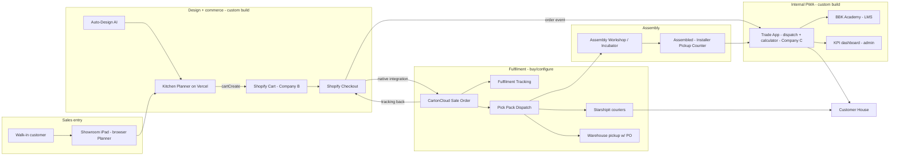
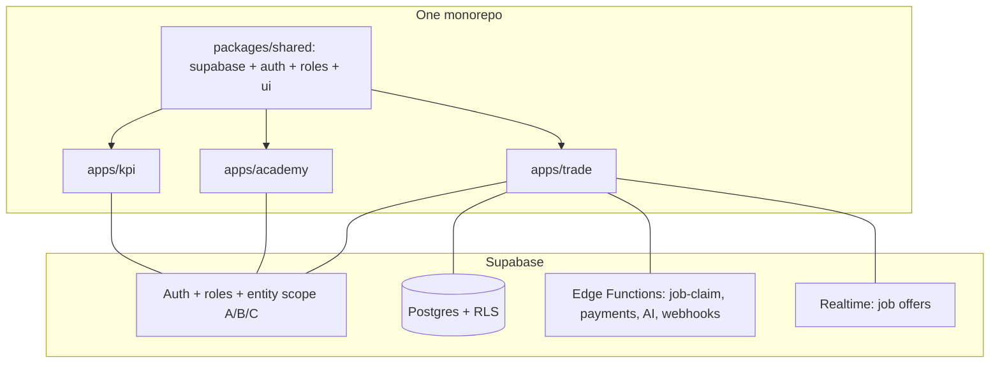

# Brown Box Kit — Full Ecosystem Feasibility Study

> Planning document. **No application code is changed by this file.**
> Tip: read this with Markdown Preview (`Ctrl+Shift+V`) for full-width formatting.
> Companion to `ARCHITECTURE.md` (the Planner) and `AUTO-DESIGN-PLAN.md` (auto-design).
> This doc covers the **wider system**: Planner + Shopify + CartonCloud + Trade App +
> Academy + KPI, across the A/B/C company structure.

---

## 0. What this document is for

A shared "single picture" of the whole business system, written **before** money is spent
on building it. It exists so that:

- **You** record the big decisions once (feasible? build-vs-buy, one-app-vs-three, the
  A/B/C entity model, payment terms) instead of re-deciding them later.
- **Your accountant + lawyer** can read the entity, payments, credit-check and interest
  sections and advise — those parts are deliberately written for them.
- **Opus / any agent** gets the context to design the hard parts (payments, multi-entity
  security, identity) without re-explaining the system.
- **Your trainee** can orient to the whole system, not just one code file.

It is documentation, not code. It guides the build and de-risks decisions.

---

## 1. Verdict (up front)

**The ecosystem is feasible, and a large part of it is buy/configure, not build.**

- The entire **fulfilment leg** (Shopify checkout -> CartonCloud Sale Order -> pick/pack/
  dispatch -> Starshipit courier -> tracking back to Shopify) is **off-the-shelf
  SaaS-to-SaaS configuration**, not custom code.
- Your real **custom build** surface is: the Planner (done), Send-to-Cart (planned), and
  the internal **Trade + Academy + KPI** app.
- Recommended build of the internal app: **ONE monorepo, ONE Supabase auth with roles,
  three role-gated surfaces** — not three independent apps.
- The **hardest, riskiest** piece is installation payments (deposit / progress / interest /
  refund) across three legal entities — isolated to the last phase and gated behind legal
  + accountant sign-off.

---

## 2. Build vs Buy (the key feasibility split)

### Buy / configure (vendor-managed, no custom code)

| Capability | How | Notes |
|---|---|---|
| Shopify order -> CartonCloud Sale Order | Native CartonCloud Shopify integration | Transfers address, line items, order ref |
| Inventory sync + fulfilment status + tracking back to Shopify | CartonCloud | Auto-marks Shopify order fulfilled at a chosen status |
| CartonCloud -> couriers (NZ Post, CourierPost, etc.) | Starshipit (integration built by CartonCloud) | Tracking returns to CartonCloud -> Shopify |
| Pick / Pack / Dispatch + warehouse pickup w/ PO | CartonCloud workflow features | — |

> **Caveat:** CartonCloud's Shopify + Starshipit setup is **support-gated and quoted**
> (paid onboarding, per-API-call costs) — a lead-time + budget item, not a code item.
> Start this vendor conversation early.

### Build (custom)

- Send-to-Cart in the Planner (`cartCreate` -> `cart.checkoutUrl`) — already planned.
- Trade App, Academy, KPI (the internal PWA).
- A small backend (Supabase Edge Functions) for anything that can't be client-side:
  webhooks, job-claim concurrency, payments, AI question generation, interest/refund.

---

## 3. The three companies (A / B / C)

The software is **one system**; the companies are **data, not separate apps**.

| Entity | Role | Owns | Customer pays them for |
|---|---|---|---|
| **Company A** | Software + brand owner; licenses to B and C | All software, the brand, theming/licence config | — (A's revenue is B2B licence fees from B and C) |
| **Company B** | Licensee; import + supply | Shopify store + CartonCloud account | **Materials** (via Shopify) |
| **Company C** | Installation company | Nothing (uses licensed Trade App); contracts installers | **Installation** (separate contract + separate Stripe rail) |

Design rules that follow from this:

- **Entity-aware from day one** — every order / job / quote / payment / contract row
  carries an entity tag (A/B/C). Cheap now, painful to retrofit. Aligns with the
  white-label / multi-tenant direction in `ARCHITECTURE.md` section 6 (Phase 3).
- **Do not build self-serve multi-tenancy yet** — A/B/C are three fixed, known entities.
  Tag and scope them; defer tenant signup.
- **Two customer-facing payment rails, kept clean:** B = materials (Shopify, B is merchant
  of record); C = installation (Stripe under **C's own account** for clean merchant-of-
  record). A's licence fees stay out of the customer flow (manual/out-of-band for v1).
- **One order, one source of truth** = Shopify (Company B). The Trade App `job` references
  the Shopify order and links the C installation contract — it does **not** re-create
  orders. (The diagram shows "Order Created" in three places; collapse to one.)

---

## 4. System map

---

## 5. The one-app-vs-three decision

**Recommendation: one monorepo, one Supabase auth + roles, three role-gated surfaces.**

- **KPI has almost no data of its own** — it is a read-model over Trade jobs + Academy
  scores + Shopify orders. A separate app would just duplicate auth and data access.
- **Academy completion can gate Trade eligibility** ("certified to accept this install") —
  trivial with shared identity, an integration headache across three apps.
- One Google login, one installer profile, one deploy pipeline, one RLS policy set.
  Three separate apps = 3x auth/infra/maintenance for one team.
- You already own the stack (Vite + Supabase + Vercel + Google OAuth in `auth.js`) —
  extend it, don't fork it.

Structure (the existing Planner monolith is **left untouched** per house rules):

- `packages/shared` — Supabase client, auth, roles, UI primitives.
- `apps/trade`, `apps/academy`, `apps/kpi` — thin PWAs importing `shared`.
- Each can deploy to its own subdomain (`trade.` / `academy.` / `kpi.brownboxkit.co.nz`)
  for installable PWAs while sharing one codebase + one DB. This honours the diagram's
  "Independent App for KPI" wording without a separate codebase.

---

## 6. Module specs

### 6.1 Trade App

- **Job cost calculator** (admin-editable rates in a `pricing_rules` table):
  - Assembly: fixed **$20–40 per cabinet** (by cabinet type).
  - Base cabinet install: **$120 / metre**.
  - Wall cabinet install: **$240 / metre**.
  - Top filler: **$10 / metre**. Drawers: **$25 / drawer**.
  - **Quantities come from the Planner design** (cabinet count, base run m, wall run m,
    filler m, drawer count). One kitchen design produces both the material price (Shopify,
    B) and the installation price (calculator, C).
- **Uber-style dispatch:** a job is offered to one installer with a countdown; accept in
  time or it auto-passes to the next. Supports a 1st and 2nd installer. Completion triggers
  a **compulsory rating**.
- **Payment terms:**
  - Default: customer pays in full (materials to B + installation to C).
  - Registered + credit-checked customers only: **50% deposit, balance on completion**.
  - Cancellation **≥ 24h before** install -> **full refund** of installation.
  - **Late payment accrues strict interest** (automated).
  - Each installer signs a **separate contract with Company C** (contractor, not employee).

### 6.2 BBK Academy

- Admin uploads a **module** (video / doc / text).
- On upload, an Edge Function calls an **LLM to auto-generate a question bank (min 10)**
  from the content. **Human review before publish.**
- **Monthly exam:** each assigned partner / employee / staff completes ≥ 10 questions and
  submits before the deadline; auto-graded; score feeds KPI.

### 6.3 KPI (admin-only central dashboard)

- Monthly Academy exam score + an **AI-written summary/description** auto-feeds KPI.
- **Per-installer profile:** jobs completed, jobs missed/declined, customer reviews/ratings,
  and leads actively brought in.
- **Performance bands:** non-performance / good performance / lead contribution -> drives
  the **bonus** calculation.
- Pure read-model + AI summaries over jobs, ratings, submissions, leads.

---

## 7. Auth & data model

- **One Supabase project.** Roles with **entity scope**: A super-admin (software + brand),
  B-admin (supply/commerce), C-admin (install ops), then `installer` / `staff` under C/B,
  and customer `user` (the existing Planner account). Extends the `profiles` table proposed
  in `ARCHITECTURE.md` section 3.
- **RLS scopes rows by entity AND role.** This is the #1 security surface — a role/entity
  mistake leaks one company's data to another. RLS is non-negotiable before any internal
  data lands (already the top open item in `ARCHITECTURE.md` section 4).
- **New tables (sketch):** `entities`, `installers`, `pricing_rules`, `install_quotes`,
  `install_contracts`, `jobs` (-> Shopify order id), `job_offers`, `job_ratings`,
  `payments`, `credit_checks`, `leads`, `academy_modules`, `academy_questions`,
  `academy_submissions`, `kpi_events`.

---

## 8. Integration mechanics

- **Planner -> Cart:** Shopify Storefront `cartCreate` -> redirect `cart.checkoutUrl`
  (public token is safe per house rules).
- **Shopify -> Trade App:** `orders/paid` webhook -> Supabase Edge Function -> insert a
  `jobs` row. (Webhook needs a backend endpoint — Edge Function, not pure frontend.)
- **Shopify -> CartonCloud -> Starshipit:** native, vendor-configured. CartonCloud also
  exposes REST (`POST /tenants/{tenantId}/outbound-orders`) + webhooks if a custom flow is
  ever needed.
- **Installation payments (C):** Stripe under C's account; deposit/progress/refund/interest
  handled by Edge Functions + scheduled jobs.
- **KPI:** `kpi_events` fed from Trade actions + Academy completions + Shopify orders.

---

## 9. Risks & things to watch

| # | Risk | Watch / mitigation |
|---|---|---|
| 1 | **Installation payments** (deposit/progress/interest/refund) = regulated money movement | Backend + Stripe under C; isolate to Phase 4; legal + accountant sign-off first |
| 2 | **Entity tagging retrofit** is painful | Tag A/B/C on every operational row in Phase 0 |
| 3 | **RLS / role+entity leakage** between A/B/C | RLS scoped by entity AND role; test cross-entity isolation explicitly |
| 4 | **Job-claim concurrency** (1st/2nd installer race) | Atomic server-side claim (Edge Function + row lock), not client-side |
| 5 | **Notifications on iOS PWA** are limited/less reliable | Email-first for job offers; in-app realtime when open; native wrap (Capacitor) only if needed |
| 6 | **CartonCloud onboarding** is paid + support-gated + lead-time | Start vendor conversation early; budget API-call costs |
| 7 | **AI exam quality** | Human review of generated questions before publish; store generated vs approved separately |
| 8 | **Single source of truth for orders** | Shopify (B) owns orders; Trade `jobs` reference, never re-create |
| 9 | **Showroom iPad** shared-device login + lead capture | Guest/kiosk mode + "email me this design" |
| 10 | **Offline in the field** | PWA caching for installer job lists |

### Legal / accountant (you are fast-tracking these)

- Deposit + progress + **interest** terms may trigger NZ **consumer credit rules (CCCFA)**.
- **Credit checks** must comply with the **Privacy Act 2020 + Credit Reporting Privacy
  Code**; choose a bureau (Centrix / Equifax NZ / illion) and get the consent flow right.
- **Three-entity (A/B/C)** structure has **GST, inter-company licensing, transfer-pricing,
  liability, and merchant-of-record** implications. The software just records which entity
  owns each row; the structure between A/B/C is lawyer + accountant territory. Confirm who
  is merchant of record on each customer payment and what the A->B / A->C licence
  agreements say.

> Per the house rules in `AGENTS.md`, the payments + identity + multi-entity structure is
> **architecture-level** — take it to Opus for a design pass before building Phase 4.

---

## 10. Phased plan

| Phase | Outcome | Money? |
|---|---|---|
| **0 — Foundation** | Monorepo (`packages/shared`); Supabase auth + roles with entity scope (A/B/C); `entities` table + entity tag on every operational row; RLS scoped by entity AND role; Edge Functions scaffold; role-gated app shells. Planner untouched. | No |
| **1 — Trade core** | Pricing-rules calculator pulling quantities from Planner designs; jobs from Shopify `orders/paid` webhook; Uber-style offer/accept/decline with timeout + atomic claim; 1st/2nd installer; completion + compulsory rating. | Manual ("mark paid") |
| **2 — Academy** | Module upload; AI question generation + human review; monthly assignment; submission; auto-grade. | No |
| **3 — KPI** | Installer profiles; job/missed/rating/leads aggregation; exam-score feed; performance bands; bonus calc; AI summaries. | No |
| **4 — Payments + contracts** (gated) | Three-entity billing; Stripe under C; deposit/progress; 24h refund; credit check; late-payment interest cron; installer contracts. **Opus design + legal/accountant sign-off required.** | Yes |
| **5 — Automation / polish** | Notifications (email-first); offline caching; scheduled-job hardening; reporting/export. | — |

**Why payments is last:** everything except Phase 4 is usable with manual payment, so the
regulated money/legal work is isolated and does not block the rest of the system going live.

---

## 11. Open decisions

- Payments: manual for v1, or build Stripe (C) billing in Phase 4? Escrow vs direct.
- Credit-check bureau (Centrix / Equifax NZ / illion) + consent flow.
- C's installation payments via **C's own Stripe** (recommended) vs routed through B.
- Assembly tracking: CartonCloud production status vs a Trade App state.
- KPI as a surface within the app vs its own subdomain deploy.
- Notifications channel priority (email-first vs push, given iOS PWA limits).
- Native wrap (Capacitor) trigger criteria if PWA push proves insufficient.
- A->B / A->C licence model + merchant-of-record per payment (legal/accountant).
