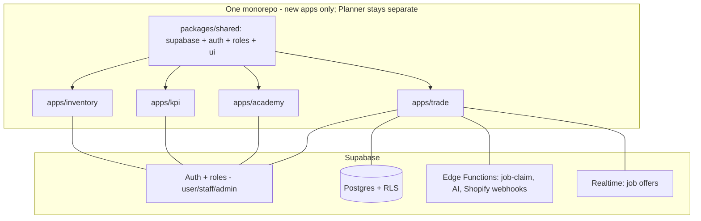

# Brown Box Kit — Full Ecosystem Feasibility Study

> Planning document. **No application code is changed by this file.**
> Tip: read this with Markdown Preview (`Ctrl+Shift+V`) for full-width formatting.
> Companion to `ARCHITECTURE.md` (the Planner) and `AUTO-DESIGN-PLAN.md` (auto-design).
> This doc covers the **wider system**: Planner + Shopify + CartonCloud + Trade App +
> Academy + KPI + Inventory, as a **single business entity**.

> **Revision (simplified model):** collapsed the former A/B/C three-entity model to a
> **single entity**; removed the Stripe installation-payments rail and all credit-check /
> interest / refund machinery (all money flows through **Shopify standard checkout**);
> scoped the **Inventory App as a network-visibility layer** that reads the **Shopify Admin
> API** (not the CartonCloud API) and surfaces CartonCloud as one virtual warehouse; added
> an **in-house delivery leg** (workshop -> customer) inside the Trade App. Inter-company
> arrangements, if any, are contractual — not modelled in the software.

---

## 0. What this document is for

A shared "single picture" of the whole business system, written **before** money is spent
on building it. It exists so that:

- **You** record the big decisions once (feasible? build-vs-buy, one-app-vs-many,
  scope boundaries) instead of re-deciding them later.
- **Your accountant + lawyer** can read the commerce/fulfilment boundaries and advise —
  noting that customer money flows entirely through Shopify standard checkout.
- **Opus / any agent** gets the context to design the hard parts (identity, dispatch
  concurrency, inventory trust boundaries) without re-explaining the system.
- **Your trainee** can orient to the whole system, not just one code file.

It is documentation, not code. It guides the build and de-risks decisions.

---

## 1. Verdict (up front)

**The ecosystem is feasible, and a large part of it is buy/configure, not build.**

- The entire **fulfilment leg** (Shopify checkout -> CartonCloud Sale Order -> pick/pack/
  dispatch -> Starshipit courier -> tracking back to Shopify) is **off-the-shelf
  SaaS-to-SaaS configuration**, not custom code.
- Your real **custom build** surface is: the Planner (largely done, incl. Send-to-Cart),
  and the internal **Trade + Academy + KPI + Inventory** app.
- Recommended build of the internal app: **ONE monorepo, ONE Supabase auth with roles,
  four role-gated surfaces** (Trade, Academy, KPI, Inventory) — not separate apps.
- **Payments are out of scope:** BBK is the sole vendor and all customer money flows
  through **Shopify standard checkout**. This removes the single biggest legal/regulatory
  risk (no Stripe rail, no credit checks, no interest/refund engine to build).

---

## 2. Build vs Buy (the key feasibility split)

### Buy / configure (vendor-managed, no custom code)

| Capability | How | Notes |
|---|---|---|
| Shopify order -> CartonCloud Sale Order | Native CartonCloud Shopify integration | Transfers address, line items, order ref |
| Inventory sync + fulfilment status + tracking back to Shopify | CartonCloud | Auto-marks Shopify order fulfilled at a chosen status |
| CartonCloud -> couriers (NZ Post, CourierPost, etc.) | Starshipit (integration built by CartonCloud) | Tracking returns to CartonCloud -> Shopify |
| Pick / Pack / Dispatch + warehouse pickup w/ PO | CartonCloud workflow features | — |

> **Caveat:** CartonCloud's Shopify + Starshipit setup is **support-gated and quoted**
> (paid onboarding, per-API-call costs) — a lead-time + budget item, not a code item.
> Start this vendor conversation early.

### Build (custom)

- Send-to-Cart in the Planner (`cartCreate` -> `cart.checkoutUrl`) — done.
- Trade App, Academy, KPI, Inventory (the internal PWA surfaces).
- A small backend (Supabase Edge Functions) for anything that can't be client-side:
  Shopify webhooks (orders, inventory), job-claim concurrency, AI question generation.
  (No payments backend — money is Shopify-standard.)

---

## 3. Single entity (simplified)

**BBK is one business entity.** The software does **not** model multiple companies, entity
tags, or inter-company licensing — any such arrangements are **contractual**, handled
outside the software. This is a deliberate simplification of the earlier A/B/C model.

Design rules that follow from this:

- **No entity tagging.** Rows are scoped by **user + role** via RLS, not by an entity tag.
  (If a true multi-tenant/white-label direction is ever pursued — `ARCHITECTURE.md`
  section 6, Phase 3 — it is a future, explicit re-architecture, not a day-one cost.)
- **One customer-facing payment rail:** **Shopify standard checkout**, BBK as merchant of
  record. Installation (if billed) is invoiced the same way or out-of-band; there is **no
  separate Stripe rail, no credit checks, no interest/refund engine** in scope.
- **One order, one source of truth = Shopify.** The Trade App `job` references the Shopify
  order; it does **not** re-create orders.

---

## 4. System map

```mermaid
flowchart LR
  subgraph entry [Sales entry]
    walkIn[Walk-in customer]
    showroom[Showroom iPad - browser Planner]
    walkIn --> showroom
  end

  subgraph design [Design + commerce - custom build]
    autoDesign[Auto-Design AI]
    planner[Kitchen Planner on Vercel]
    autoDesign --> planner
    planner -->|cartCreate| cart[Shopify Cart]
    cart --> checkout[Shopify Checkout]
  end
  showroom --> planner

  subgraph fulfil [Fulfilment - buy/configure - 3PL owns past scan-in]
    cc[CartonCloud Sale Order]
    pick[Pick Pack Dispatch]
    star[Starshipit couriers]
    cc --> pick
    pick --> star
  end
  checkout -->|native integration| cc
  cc -->|tracking + inventory back| checkout

  subgraph assembly [Assembly - Trade App workflow state]
    workshop["Workshop (jobs.stage at_workshop)"]
    assembled["Assembled (jobs.stage assembled)"]
    workshop --> assembled
  end
  pick -->|drop for assembly| workshop

  subgraph trade [Internal PWA - custom build - single entity]
    tradeApp[Trade App - dispatch + calculator]
    delivery[In-house delivery - workshop to house]
    academy[BBK Academy - LMS]
    kpi[KPI dashboard - admin]
    inventory["Inventory App - reads Shopify Admin API; CC as virtual warehouse"]
  end
  checkout -->|orders/paid webhook| tradeApp
  assembled --> tradeApp
  tradeApp --> delivery
  tradeApp --> academy
  tradeApp --> kpi
  checkout -.->|inventory_levels webhook| inventory

  star -->|direct: no assembly| house[Customer House]
  delivery -->|assembled kitchens| house
```

---

## 5. The one-app-vs-many decision

**Recommendation: one monorepo, one Supabase auth + roles, four role-gated surfaces
(Trade, Academy, KPI, Inventory).**

- **KPI has almost no data of its own** — it is a read-model over Trade jobs + Academy
  scores + Shopify orders. A separate app would just duplicate auth and data access.
- **Academy completion can gate Trade eligibility** ("certified to accept this install") —
  trivial with shared identity, an integration headache across three apps.
- One Google login, one installer profile, one deploy pipeline, one RLS policy set.
  Three separate apps = 3x auth/infra/maintenance for one team.
- You already own the stack (Vite + Supabase + Vercel + Google OAuth in `auth.js`) —
  extend it, don't fork it.

Structure (the existing Planner monolith is **left untouched and stays in its own repo**
per house rules; re-evaluate folding it in at Phase 7):

- `packages/shared` — Supabase client, auth, roles, UI primitives.
- `apps/trade`, `apps/academy`, `apps/kpi`, `apps/inventory` — thin PWAs importing `shared`.
- Each can deploy to its own subdomain (`trade.` / `academy.` / `kpi.` /
  `inventory.brownboxkit.co.nz`) for installable PWAs while sharing one codebase + one DB.

---

## 6. Module specs

### 6.1 Trade App

- **Job cost calculator** (admin-editable rates in a `pricing_rules` table):
  - Assembly: fixed **$20–40 per cabinet** (by cabinet type).
  - Base cabinet install: **$120 / metre**.
  - Wall cabinet install: **$240 / metre**.
  - Top filler: **$10 / metre**. Drawers: **$25 / drawer**.
  - **Quantities come from the Planner design** (cabinet count, base run m, wall run m,
    filler m, drawer count). One kitchen design produces both the material price (Shopify,
    B) and the installation price (calculator, C).
- **Uber-style dispatch:** a job is offered to one installer with a countdown; accept in
  time or it auto-passes to the next. Supports a 1st and 2nd installer. Completion triggers
  a **compulsory rating**.
- **Assembly workshop = workflow state** on the job, not a separate system:
  `jobs.stage = 'at_workshop' | 'assembled'` (lightweight for v1; revisit Inventory-node
  tracking later if needed).
- **In-house delivery leg (workshop -> customer house):** assembled kitchens are delivered
  by a BBK-managed driver (route view, maps handoff, proof-of-delivery photo + signature),
  using the **same dispatch engine** as install. **3PL last-mile (Starshipit) applies only
  when no assembly is required** — flat-pack ships direct from the 3PL.
- **Payments:** Shopify standard checkout only. No deposit/interest/refund logic, no credit
  checks, no separate installation payment rail in scope.

### 6.2 BBK Academy

- Admin uploads a **module** (video / doc / text).
- On upload, an Edge Function calls an **LLM to auto-generate a question bank (min 10)**
  from the content. **Human review before publish.**
- **Monthly exam:** each assigned partner / employee / staff completes ≥ 10 questions and
  submits before the deadline; auto-graded; score feeds KPI.

### 6.3 KPI (admin-only central dashboard)

- Monthly Academy exam score + an **AI-written summary/description** auto-feeds KPI.
- **Per-installer profile:** jobs completed, jobs missed/declined, customer reviews/ratings,
  and leads actively brought in.
- **Performance bands:** non-performance / good performance / lead contribution -> drives
  the **bonus** calculation.
- Pure read-model + AI summaries over jobs, ratings, submissions, leads.

### 6.4 Inventory App (network-visibility layer, not a WMS)

- **Scope:** a visibility tool, not a warehouse management system. It does **not** try to
  overrule Shopify (orders) or CartonCloud (3PL stock).
- **Owns (authoritative):** your **own** locations — **China origin** + **BBK NZ holding** —
  as data: location tree, on-hand, in-transit shipments, and transfers between your own
  warehouses (a simple state machine).
- **Reads (not authoritative):** **CartonCloud 3PL stock via the Shopify Admin API**
  (`inventory_levels` per location + the `inventory_levels/update` webhook). Shopify already
  mirrors CartonCloud, so reading Shopify gives the same numbers with **one fewer API,
  token, rate limit, and vendor relationship**. CartonCloud is surfaced as a single
  **virtual warehouse row**. Trust boundary: you see what CC reports to Shopify (incl. any
  sync lag) — correct, since the 3PL is contractually responsible for CC accuracy.
- **v1:** own warehouses + in-transit + read CartonCloud as a virtual warehouse; scanner
  (BT HID + phone camera); role-based access.
- **v2:** three.js bin-precision 3D warehouse view (reuses Planner patterns), shipped only
  after v1 is proven in production.

---

## 7. Auth & data model

- **One Supabase project.** Roles (no entity scope): `admin` (you/ops), `staff` (BBK team),
  `installer` (contracted), and customer `user` (the existing Planner account). Extends the
  `profiles` table proposed in `ARCHITECTURE.md` section 3.
- **RLS scopes rows by user + role.** This is the #1 security surface — RLS is
  non-negotiable before any internal data lands (already the top open item in
  `ARCHITECTURE.md` section 4).
- **New tables (sketch):** `installers`, `pricing_rules`, `install_quotes`,
  `jobs` (-> Shopify order id, `stage`), `job_offers`, `job_ratings`, `deliveries`
  (in-house leg + proof-of-delivery), `leads`, `academy_modules`, `academy_questions`,
  `academy_submissions`, `kpi_events`, and Inventory: `warehouses`, `locations`,
  `stock_levels`, `shipments` (in-transit), `transfers`. (Dropped from the old model:
  `entities`, `install_contracts`, `payments`, `credit_checks`.)

---

## 8. Integration mechanics

- **Planner -> Cart:** Shopify Storefront `cartCreate` -> redirect `cart.checkoutUrl`
  (public token is safe per house rules).
- **Shopify -> Trade App:** `orders/paid` webhook -> Supabase Edge Function -> insert a
  `jobs` row. (Webhook needs a backend endpoint — Edge Function, not pure frontend.)
- **Shopify -> Inventory App:** `inventory_levels/update` webhook + `inventory_levels`
  reads via the **Shopify Admin API** — the single source for 3PL stock (CartonCloud
  mirrors into Shopify). No direct CartonCloud API integration in scope.
- **Shopify -> CartonCloud -> Starshipit:** native, vendor-configured. POs originate in
  CartonCloud via the Shopify integration — no PO logic in our app.
- **Payments:** none to integrate — Shopify standard checkout is the whole money path.
- **KPI:** `kpi_events` fed from Trade actions + Academy completions + Shopify orders.

---

## 9. Risks & things to watch

| # | Risk | Watch / mitigation |
|---|---|---|
| 1 | **RLS / role leakage** (customer vs staff vs installer data) | RLS scoped by user + role; test isolation explicitly before any internal data lands |
| 2 | **Job-claim concurrency** (1st/2nd installer race) | Atomic server-side claim (Edge Function + row lock), not client-side |
| 3 | **Inventory trust boundary** (Shopify reflects CC lag/bugs) | Read-only past 3PL scan-in; surface CC as a virtual warehouse; 3PL owns CC accuracy contractually |
| 4 | **Notifications on iOS PWA** are limited/less reliable | Email-first for job offers; in-app realtime when open; native wrap (Capacitor) only if needed |
| 5 | **CartonCloud onboarding** is paid + support-gated + lead-time | Start vendor conversation early; we only *read* CC via Shopify, so no CC API quota to negotiate |
| 6 | **AI exam quality** | Human review of generated questions before publish; store generated vs approved separately |
| 7 | **Single source of truth for orders** | Shopify owns orders; Trade `jobs` reference, never re-create |
| 8 | **Showroom iPad** shared-device login + lead capture | Guest/kiosk mode + "email me this design" (Planner backlog) |
| 9 | **Offline in the field** | PWA caching for installer job lists |

### Legal / accountant (lighter now that payments are out of scope)

- **Customer payments are Shopify-standard** (BBK merchant of record) — this removes the
  CCCFA / credit-reporting exposure that the old deposit/interest/credit-check model carried.
- **Privacy Act 2020** still applies to stored customer data (Planner designs, accounts,
  leads, delivery proof-of-delivery photos/signatures) — keep a privacy policy, consent,
  and a data-export path (ties to Planner Task P-3). Set a retention policy consciously.
- Any **inter-company / licensing** arrangements are contractual and **outside the
  software** — lawyer/accountant territory, not a build concern.

---

## 10. Phased plan

This is the cross-system phase plan (current roadmap). Critical path: **P1 -> P2 -> P4 ->
P5 -> P8.** P3 (Auto-Design) can run parallel to P2/P4 (separate repo). All money is
Shopify-standard, so there is **no gated payments phase**.

| Phase | Outcome |
|---|---|
| **P1 — Planner Phase 1 complete** | Quote PDF (Tier 0), share links, analytics, snap rules, Shopify embed (subdomain link), privacy/T&Cs/export, pre-launch review. Planner v1.0 public. (App Proxy + canvas PDF designer deferred to Phase 2.) |
| **P2 — Monorepo foundation** | pnpm + Turborepo; `packages/shared` (Supabase, auth, roles); RLS scaffold (user/role, no entity scope); Edge Function scaffold. Planner stays in its own repo. |
| **P3 — Auto-Design module** | Per `AUTO-DESIGN-PLAN.md`. Feature-flagged, built in the Planner repo; can run parallel to P2/P4. |
| **P4 — Trade App core** | Pricing-rules calculator from Planner designs; `orders/paid` webhook -> `jobs` row with `stage`; Uber-style dispatch (atomic claim); 1st/2nd installer; completion + rating. (Manual "mark paid" — money is Shopify-standard.) |
| **P5 — Trade App: in-house delivery leg** | Driver dispatch (workshop -> customer), route view, maps handoff, proof-of-delivery (photo + signature). Same dispatch engine as install. |
| **P6 — BBK Academy** | Module upload; AI question gen (Edge Function); human review queue; monthly assignment + auto-grade. |
| **P7 — KPI dashboard** | Read-model views; per-installer profile; performance bands; AI monthly summaries. (Re-evaluate folding Planner into the monorepo here.) |
| **P8 — Inventory App v1** | Own warehouses (China origin + BBK NZ holding) CRUD; location tree as data; **Shopify Admin API read** for 3PL stock (CC as virtual warehouse); in-transit tracking; transfer state machine; scanner (BT HID + camera); role-based access. |
| **P9 — Inventory App v2** | three.js bin-precision 3D warehouse view; reuses Planner patterns; after v1 proven. |
| **P10 — Notifications, offline, polish** | Web Push where supported; email-first job offers (iOS); PWA offline caching; Sentry + analytics; reporting/export. |
| **P11 — Native wrap (conditional)** | Only if PWA push proves insufficient or scanner needs native APIs. Capacitor wrap. |

---

## 11. Open decisions

**Resolved in this revision:**
- ~~Payments / Stripe / credit-check / interest~~ -> **out of scope**; Shopify-standard only.
- ~~A/B/C entity model~~ -> **single entity**; inter-company stuff is contractual.
- Assembly tracking -> **Trade App workflow state** (`jobs.stage`), not a separate system.
- Planner in the monorepo -> **keep in its own repo for now**; re-evaluate at P7.
- Showroom kiosk mode -> **Planner backlog**, not pre-built.
- Inventory 3PL stock source -> **Shopify Admin API** (CC as virtual warehouse), not CC API.

**Still open:**
- Monorepo name + Vercel/Supabase project naming convention (lock before P2).
- Subdomain plan: `trade.` / `academy.` / `kpi.` / `inventory.brownboxkit.co.nz` (confirm before DNS).
- KPI as a surface within the app vs its own subdomain deploy.
- Notifications channel priority (email-first vs push, given iOS PWA limits).
- Native wrap (Capacitor) trigger criteria if PWA push proves insufficient.
- Data retention policy for stored customer data (NZ Privacy Act) — pick a window.
