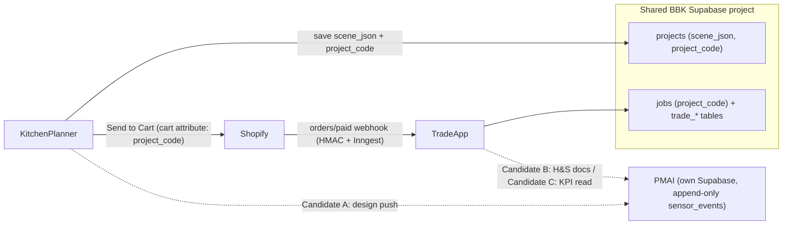
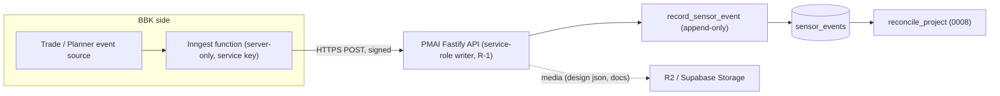
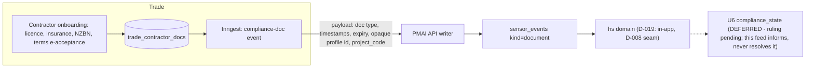
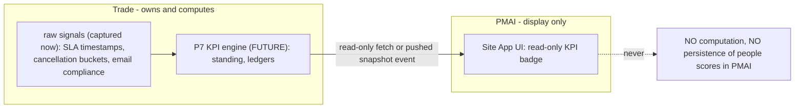
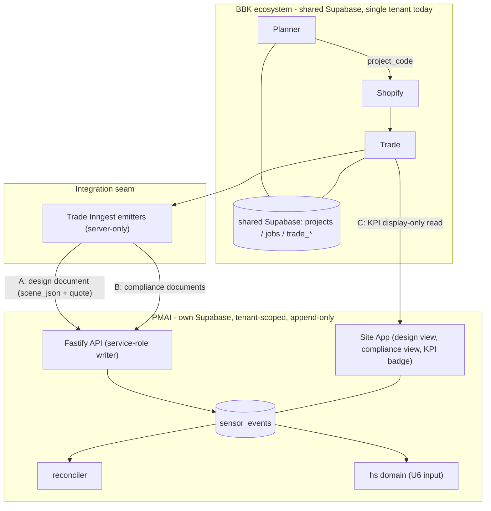

<!-- NON-AUTHORITATIVE — reference only; not project scope. Renamed from PMAI-INTEGRATION-CANDIDATES.md. See TASKS.md for authoritative scope. -->

# BBK <-> PMAI Candidate Integrations — Combined Architecture

> **Local note (planner repo copy):** this file is a **verbatim mirror** of the same
> note held on the PMAI side. It is recorded here so the BBK planner repo has its own
> copy of the cross-repo picture. It is **REFERENCE TIER — NON-AUTHORITATIVE** and
> **not a task**: see `TASKS.md` for actual scope. Do not plan or build anything below
> without the preconditions landing as owner-signed decisions in *both* repos
> (`AGENTS.md` locks BBK cross-repo paths to Supabase + Shopify webhooks; a PMAI path
> is a new integration channel requiring the owner's ruling here too).

> REFERENCE TIER — NON-AUTHORITATIVE. This note documents *candidate future*
> integrations between PMAI and the Brown Box Kit (BBK) ecosystem. Nothing in
> this file is in scope. No integration below may be planned or built until its
> preconditions land as `DECISIONS.md` entries with owner sign-off (PMAI side)
> and an equivalent architecture decision in the BBK repo (`AGENTS.md` locks
> BBK cross-repo paths to Supabase + Shopify webhooks; a PMAI path is a new
> integration channel requiring the owner's ruling there too).
>
> Written by the owner-side auditor 2026-07-22 after a file-level review of:
> - `bbk-monorepo` (Trade app: authority docs, all 17 migrations, Hono/Inngest
>   server, `SCOPE-SCENARIO-2-TRADE.md`)
> - `kitchen-planner-v3` (Planner: `ARCHITECTURE.md`, `auth.js`, `main.js`
>   scene serialization + Send-to-Cart)
> - PMAI current authority (`docs/control/`, state as of S11b DONE / S12 plan-only)

---

## 1. The ecosystem today (context)

Three owner-controlled systems already exist. Two of them (Planner, Trade) are
already chained by a shared join key; PMAI is currently unconnected.

| System | Repo | Stack | Role |
|---|---|---|---|
| Kitchen Planner | `kitchen-planner-v3` | vanilla JS + three.js, Supabase, Shopify Storefront API, Vercel | Customer-facing 3D/2D kitchen design + quote + Send-to-Cart |
| Trade | `bbk-monorepo` (`apps/trade`) | React/Vite/TS, Hono on Vercel, Inngest, Supabase (shared with Planner) | Fulfilment workflow: order intake, dispatch (driver/installer), material legs, comms, contractor onboarding, KPI raw signals |
| PMAI | this repo | pnpm monorepo, Fastify API, own Supabase Postgres, append-only event log | Autonomous construction supervisor (Layer-1 Site App + observe-only brain) |

**Key existing thread — `project_code`:** a saved Planner project mints a stable
`project_code`; Send-to-Cart stamps it as a Shopify cart attribute; the
order-paid webhook lands it on Trade's `jobs.project_code`. Design → order →
fulfilment job is already one traceable thread. Every candidate integration
below reuses this key as the correlation id inside PMAI event payloads.



---

## 2. Shared integration foundations (apply to all three)

These rules keep every candidate inside both repos' standing architecture:

- **Transport:** BBK pushes to PMAI's service-role API writer (R-1 pattern —
  same seam as S11b). On the BBK side the natural emitter is an **Inngest
  function** (their sanctioned event machinery). PMAI never reads BBK's
  database; BBK never receives PMAI credentials or DB access.
- **Everything arrives as events:** payloads land in PMAI's append-only
  `sensor_events` (existing kinds where possible, e.g. `document`; any NEW
  event kind is a contract change requiring a `DECISIONS.md` entry, as D-020
  was).
- **Identity mapping:** person references cross the boundary as **opaque BBK
  profile ids inside the jsonb payload** — no FK, no shared auth. Trade holds
  the cross-company master identity; PMAI holds tenant-scoped shadows. PMAI
  identity remains QR-over-personal-phone (D-006) — no conflict; BBK auth is
  never consumed by PMAI.
- **Correlation:** `project_code` in every payload correlates design, order,
  fulfilment, and site events without either side querying the other.
- **Tenancy:** all inbound events are tenant-scoped on write (PMAI side).
  Trade already carries `tenant_id` + a JWT-claim `current_tenant()` designed
  for a future multi-tenant phase — compatible instincts, no work needed now.



---

## 3. Candidate A — Planner 3D design push

**What:** when a designed kitchen becomes a real job (order paid, or on
explicit user action), the Planner design lands in PMAI as a `document` event:
`scene_json` (versioned walls/items/settings — structured data with real
Shopify product references, better than an opaque mesh; the Planner has no GLB
export and does not need one), the quote, and the `project_code`.

**Why:** gives the PMAI brain and the Site App the as-designed artifact for
the project — same D-019 pattern as SSSP packs: *a source, not a system*.

```mermaid
sequenceDiagram
  participant P as Planner
  participant S as Shopify
  participant T as Trade (Inngest)
  participant A as PMAI API
  participant L as sensor_events

  P->>P: save project (scene_json + project_code)
  P->>S: Send to Cart (attr: project_code)
  S->>T: orders/paid webhook (HMAC verified)
  T->>T: create jobs row (project_code)
  T->>A: POST design-document event (scene_json ref, quote, project_code)
  A->>L: record_sensor_event kind=document
  Note over L: append-only; replayable; media to R2/Storage
```

**Preconditions:**
- PMAI `DECISIONS.md`: adopt BBK design push as a `document`-event source
  (decide: reuse `document` kind vs new kind — new kind = contract change).
- BBK repo: owner ruling adding "push to PMAI API" as a sanctioned
  integration path (currently limited to Supabase + Shopify webhooks).
- A PMAI project must exist to receive the event (project provisioning /
  `project_code` mapping is part of the decision).

---

## 4. Candidate B — Trade H&S / contractor compliance feed

**What:** Trade's contractor onboarding already captures licence, insurance,
NZBN/incorporation certs, and **terms e-acceptance with timestamp**
(`trade_contractors`, `trade_contractor_docs`). These records enter PMAI as
`document` events attached to the relevant project/subbie — induction and
compliance *evidence*.

**Why:** this is the best near-term fit and a direct input to PMAI's open U6
ruling (`compliance_state`: SSSP/induction mandatory fields + expiry). Trade's
real field set should inform what U6 concretizes. It does NOT resolve U6 —
U6 stays a deferred owner ruling.



**Preconditions:**
- U6 owner ruling (fields/expiry) before any `compliance_state` table exists —
  the feed can only land as opaque `document` events until then.
- Consent/legal: contractor data flowing from Trade into a builder's PMAI
  tenant needs a data-sharing clause; Trade's terms e-acceptance hook is the
  natural anchor. Pairs with PMAI's U9/legal-gate workstream.
- Same two decision entries (PMAI source adoption + BBK new path) as A.

---

## 5. Candidate C — Trade KPI read (display-only)

**What:** when Trade's P7 KPI engine exists (Green/Yellow/Red standing,
demerits, points — currently deferred; only raw signals are captured today:
registered-email compliance, 24h response-SLA timestamps, cancellation
lead-time buckets), PMAI may **display** a Trade-computed KPI. PMAI never
computes, persists, or derives people scores.

**Why the fence matters:** PMAI's drift watch prohibits behavioural/
reliability scoring of people. Trade's KPI design is explicitly *"disclosed,
never covert"* (Privacy Act 2020 + employment good-faith) and Trade owns the
score. The boundary must be recorded, not implied.



**Preconditions (hard gates):**
- Trade P7 actually built (earliest-date constraint — nothing to read today).
- PMAI `DECISIONS.md` entry fencing the non-negotiable: *"PMAI may display
  Trade-sourced KPI, never compute or persist it."* Decide whether even a
  cached snapshot is acceptable or display must be fetch-through.
- Subbie consent to cross-system KPI visibility (legal, with B's clause).

---

## 6. Combined target architecture (all three live)



**Sequencing reality (as of 2026-07-22):** Planner is pre-launch (Phase-1 MVP
tasks open), Trade is in investor-demo hardening, PMAI has S12 (override write
path) DONE + committed and the override-integrity gate CROSSED (2026-07-22 —
all three gates now crossed: RLS / Replay / Override-integrity), with S11c
(mobile own-project UI) the next task (plan-only) in the owner-accepted Phase-3
sequence. Earliest sensible slot for any bridge is after PMAI Layer-1 wiring
stabilises and, for C, after Trade P7 exists. The recommended first bridge is
**B (H&S document feed)** — smallest, highest value, and it feeds the U6 ruling.

---

## 7. Ruling checklist (what the owner must decide, per integration)

| # | Ruling | Gates | Where recorded |
|---|---|---|---|
| R-A1 | Adopt Planner/Trade design push as PMAI event source; kind reuse vs new kind; project provisioning + `project_code` mapping | A | PMAI `DECISIONS.md` |
| R-B1 | U6 `compliance_state` fields/expiry (existing deferred ruling; Trade's field set is input) | B (tables only; doc events can precede) | PMAI `DECISIONS.md` |
| R-B2 | Cross-system data-sharing consent clause (contractor docs, KPI visibility) | B, C | Legal workstream (with U9) |
| R-C1 | KPI display-only fence: PMAI may display, never compute/persist people scores; snapshot vs fetch-through | C | PMAI `DECISIONS.md` |
| R-X1 | Master-identity ruling: Trade holds cross-company subbie identity; PMAI holds tenant-scoped shadows; opaque payload refs only | A, B, C | PMAI `DECISIONS.md` |
| R-X2 | BBK side: sanction "push to PMAI API" as a new cross-repo integration path | A, B, C | BBK repo authority docs |

**Standing guardrails that no integration may weaken:** append-only event log
(overrides are new events); `tenant_id` + forced RLS on every PMAI table;
API-only service-role writes (R-1); D-008 domain seams (contact via
shared-contracts only); no face surface (D-016/U9); no people-scoring inside
PMAI; retention stays CONFIG. Neither repo's build sequence changes because of
this note.
